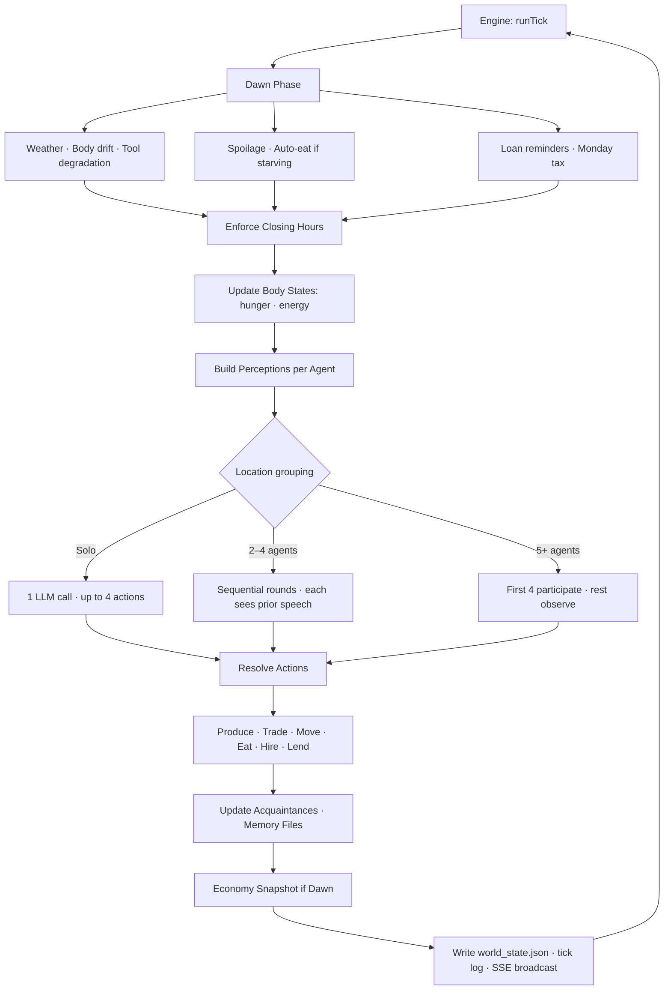
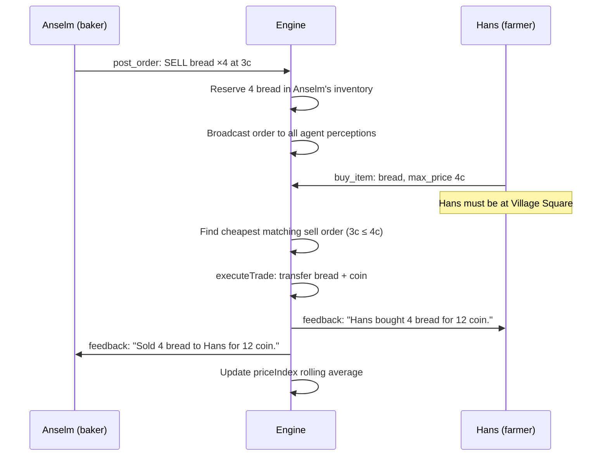
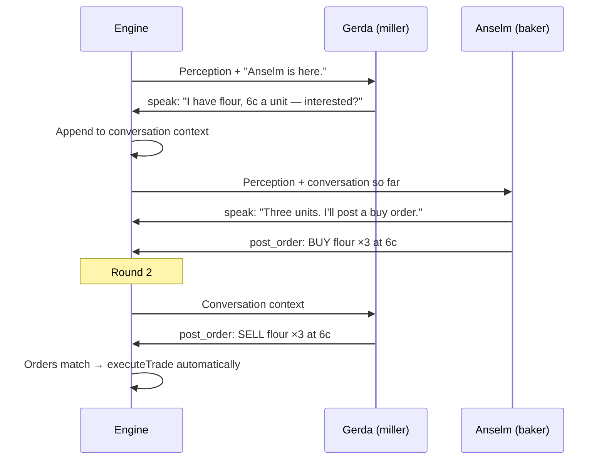

# Brunnfeld


**A medieval village economy that runs itself.**

20 LLM agents live in a 22-location village. They receive no behavioral instructions, no trading strategies, no economic goals. Each agent gets a short background — name, skill, home, starting goods — and a structured world that enforces physics: hunger, tool degradation, seasonal yields, locked doors, expiring orders, spoiling food, debt.

The agents don't produce interesting economic behavior because they're told to. They produce it because the environment constrains what's possible. A miller who controls the only flour supply creates a structural bottleneck — not because she's instructed to, but because only she has the skill and the location. That's not character design. That's supply chain architecture.

---

## How It Works

### The Core Loop

Every simulated hour, the engine builds a perception for each agent, calls the LLM, and resolves the returned actions against world state.



The agent sees the world. The agent acts. The engine resolves. That's it.

### What the Agent Actually Receives

This is the **entire prompt** for one agent turn. No system prompt. No strategy instructions.

```
You are Anselm.

[3-sentence profile from data/profiles/anselm.md]

Locations in the village: Village Square, Bakery, Mill, Tavern, ...

[memory file: People · Experiences · Important]

---

Spring, Monday 08:00. Bakery. Day 1/7.
Weather: Clear, 12°C.

Gerda is here.
(You're hungry.)
Inventory: flour ×2, bread ×3
Wallet: 32 coin
Tools: Rolling Pin — 87% durability

You can produce here:
- produce "bread" → 4 bread [ready now]

Marketplace board:
  SELL: wheat ×8 at 2c (by Hans, expires in 15 ticks)
  WANT: flour ×3, paying up to 6c (Gerda)

IMPORTANT: Your wallet and inventory shown above are exact.
Verbal agreements do not transfer goods — only post_order
and buy_item create actual trades.

{ "actions": [...] }
```

That's **~300 tokens of structure** plus memory. No "you are a profit-seeking merchant." No "you should sell bread when prices are high." The environment creates those behaviors:

- Anselm has flour → he can produce bread right now
- Gerda wants flour at 6c and is standing next to him → he can negotiate
- He's hungry → he might eat his own bread before selling it

Everything the agent knows comes from what the engine fed it. The engine is the economy.

---

## The Architecture

### Engine vs. Agent: Who Controls What

```
┌─────────────────────────────┐     perception      ┌─────────────────────┐     JSON actions     ┌─────────────────────────────┐
│        ENGINE               │ ──────────────────► │    AGENT (LLM)      │ ───────────────────► │       RESOLUTION            │
│      (deterministic)        │                     │    (single call)    │                      │      (deterministic)        │
│                             │                     │                     │                      │                             │
│  · Time · Season · Weather  │                     │  · Choose action    │                      │  · Validate world rules     │
│  · Hunger · Energy · Sleep  │                     │  · Speak · Produce  │                      │  · Update inventory/wallet  │
│  · Opening hours · Routing  │ ◄───────────────────│  · Trade · Move     │                      │  · Write memory file        │
│  · Tool degradation         │    state changes    │  · Negotiate prices │                      │  · Emit SSE events          │
│  · Order book · Spoilage    │                     │  · Form alliances   │                      │                             │
│  · Recipe validation        │                     │                     │                      └─────────────────────────────┘
│  · Loans · Tax · Death      │                     └─────────────────────┘
└─────────────────────────────┘
```

The split is intentional. The engine handles **everything that would otherwise require instructing the agent**:

| Without engine enforcement | With engine enforcement |
|---|---|
| "Only produce items matching your skill" | Recipe validator checks skill + location + inputs + tool |
| "You should eat when hungry" | `(You're hungry.)` + cheapest food hint injected into perception |
| "Don't go to closed locations" | Closing-hour enforcement ejects agents, sends them home |
| "Remember what you traded yesterday" | Memory file rebuilt from actions each tick |
| "Wheat needs milling before baking" | `[Can't eat] Wheat must be milled into flour first` |
| "Post competitive prices" | Agents see the full live order book — market pressure is visible |
| "Your tools will break if you don't replace them" | Tool durability shown in perception; broken tools block production |

Every row is a **prompt instruction that was never written** because the engine handles it structurally.

### The 14-Phase Tick

```
1 tick = 1 simulated hour, 6am–9pm (16 ticks/day)
Night is skipped: body resets, sleep memory injected

Tick 1   = Spring, Monday 6am, Day 1
Tick 16  = Spring, Monday 9pm
Tick 17  = Spring, Tuesday 6am
Tick 112 = Spring, Sunday 9pm
Tick 113 = Summer, Monday 6am  (new season)
Tick 448 = Winter, Sunday 9pm  (end of year 1)
```

Each `runTick()` executes in order:

1. **Dawn phase** (first tick of day only): weather update, auto-eat starving agents, degrade tools, check food spoilage, clean expired notes, pay loan reminders, Monday tax collection by Otto (10% from all agents)
2. **Enforce closing hours** — eject agents from closed locations, route home
3. **Update body states** — hunger +1 every 4 hours, energy decay after 2pm
4. **Clear last tick's feedback** — save for perception, reset for next tick
5. **Build perceptions** — full perception string per alive agent
6. **Decision phase** — group by location, run LLM calls (solo / multi-agent rounds)
7. **Social resolution** — apply moves, build acquaintances from co-location speech
8. **Production resolution** — validate and execute produce actions
9. **Marketplace resolution** — post_order, cancel_order, expire stale orders
10. **Economic checks** — pay hired laborers, starvation check (death at tick 3)
11. **Memory update** — write agent markdown files (experiences, people, important)
12. **Economy snapshot** (first tick of day) — wealth, Gini, GDP, scarcity
13. **Write state** — persist world_state.json to disk
14. **Write tick log + SSE broadcast** — stream to web viewer

### Perception Builder

The engine constructs each agent's perception from world state. The agent never reads world state directly.

```
world_state.json
      │
      ▼
┌─────────────────────┐
│  Perception Builder │
└─────────────────────┘
      │
      ├─ Time ·············· "Spring, Monday 08:00, Day 1/7"
      ├─ Location ·········· "Bakery"
      ├─ Weather ··········· "Clear, 12°C"
      ├─ Others ··········· "Gerda is here."
      ├─ Body ·············· "(You're hungry.)"
      ├─ Inventory ········· "flour ×2, bread ×3 (1 reserved)"
      ├─ Wallet ············ "32 coin"
      ├─ Loans ············· "You owe 10c to Hans (due day 7)"
      ├─ Producible ········ "- produce bread → 4 bread [ready now]"
      ├─ Marketplace ······· "SELL: wheat ×8 at 2c (Hans)..."
      ├─ Messages ·········· "From Hans: do you have any bread?"
      └─ Feedback ·········· "[No match] Cheapest bread: 3c from Anselm."
            │
            ▼
     Perception String → Agent Prompt
```

Key design decisions:

- **Acquaintance gating**: Agents who haven't spoken don't know each other by name. The engine substitutes `"the miller from the Mill"` until they've spoken.
- **Feedback injection**: Failed actions return `[Can't do that] reason` into the next perception. Agents learn from rejection without any instruction.
- **Supply chain hints**: When a hungry agent tries to eat raw wheat, the engine returns `[Can't eat] Wheat must be milled into flour (at the Mill) then baked into bread (at the Bakery).`
- **Hunger routing**: When an agent has no food and no market food exists, the engine injects specialist knowledge — which villagers sell food, their current location, whether they're home.

---

## The Village

```
Brunnfeld

┌─────────────────────────────────────────────┐
│  Resources    │  Forest · Mine               │
│               │  Farm 1 · Farm 2 · Farm 3    │
├───────────────┼─────────────────────────────┤
│  Production   │  Mill (7am–4pm)              │
│               │  Bakery (6am–2pm)            │
│               │  Forge (7am–4pm)             │
│               │  Carpenter Shop (7am–4pm)    │
│               │  Seamstress Cottage          │
│               │  Healer's Hut (7am–5pm)      │
├───────────────┼─────────────────────────────┤
│  Commerce     │  Village Square (always)     │
│               │  Tavern (10am–9pm)           │
├───────────────┼─────────────────────────────┤
│  Community    │  Church (6am–8am only)       │
│               │  Elder's House               │
├───────────────┼─────────────────────────────┤
│  Residential  │  Cottages 1–9                │
└───────────────┴─────────────────────────────┘

All trade happens at Village Square.
Non-adjacent moves route through Village Square (2 ticks).
```

### The 20 Agents

| Agent | Skill | Home | Starting Coin | Role |
|-------|-------|------|--------------|------|
| **Hans** | farmer | Farm 1 | 30c | Primary wheat producer |
| **Heinrich** | farmer | Farm 1 | 25c | Wheat + eggs |
| **Ulrich** | farmer | Farm 3 | 20c | Vegetables |
| **Bertram** | farmer | Farm 1 | 15c | Wheat (subsistence) |
| **Konrad** | cattle | Farm 2 | 40c | Milk + meat |
| **Gerda** | miller | Mill | 45c | Wheat → flour (sole supplier) |
| **Anselm** | baker | Bakery | 32c | Flour → bread (sole supplier) |
| **Liesel** | tavern | Tavern | 55c | Ale + meals |
| **Volker** | blacksmith | Forge | 60c | Iron ore + coal → tools |
| **Wulf** | carpenter | Carpenter Shop | 35c | Timber → furniture |
| **Friedrich** | woodcutter | Cottage 7 | 22c | Timber + firewood |
| **Dieter** | miner | Cottage 8 | 18c | Iron ore + coal |
| **Rupert** | miner | Cottage 3 | 20c | Iron ore + coal |
| **Sybille** | healer | Healer's Hut | 28c | Herbs → medicine |
| **Elke** | seamstress | Seamstress Cottage | 30c | Cloth production |
| **Ida** | — | Cottage 2 | 12c | No production skill |
| **Magda** | — | Cottage 8 | 10c | No production skill |
| **Bertha** | — | Cottage 9 | 8c | Poorest agent |
| **Otto** | elder | Elder's House | 120c | Tax collector (10% every Monday) |
| **Pater Markus** | priest | Church | 25c | No economic role |

**Pre-existing acquaintances** (day 1): Hans↔Heinrich, Gerda↔Anselm, Volker↔Wulf, Friedrich↔Rupert, Dieter↔Rupert, Dieter↔Magda, Liesel↔Otto, Otto↔Pater Markus

### Supply Chains

The village has hard bottlenecks that create economic pressure without any prompting:

```
Wheat (farmers) ──→ Mill (Gerda only) ──→ Flour ──→ Bakery (Anselm only) ──→ Bread
                                                         ↑
                                               Firewood (woodcutters)

Iron Ore + Coal (miners) ──→ Forge (Volker only) ──→ Iron Tools
    ↑
  Mine

Timber (woodcutters) ──→ Carpenter Shop (Wulf only) ──→ Furniture
```

If Gerda doesn't sell flour, Anselm can't bake. If Volker doesn't make tools, farmers can't harvest. The supply chain is the motivation.

---

## The Production System

14 recipes, each locked by skill + location + inputs. Agents produce once per hour maximum.

| Item | Skill | Location | Inputs | Output | Tool required |
|------|-------|----------|--------|--------|---------------|
| wheat | farmer | Farm 1/2/3 | — | 4× | ✓ |
| vegetables | farmer | Farm 1/2/3 | — | 3× | ✓ |
| eggs | farmer | Farm 1/2/3 | — | 2× | ✗ |
| milk | cattle | Farm 2 | — | 3× | ✗ |
| meat | cattle | Farm 2 | — | 2× | ✓ |
| timber | woodcutter | Forest | — | 3× | ✓ |
| firewood | woodcutter | Forest | — | 4× | ✓ |
| iron_ore | miner | Mine | — | 3× | ✓ |
| coal | miner | Mine | — | 2× | ✓ |
| herbs | healer | Forest | — | 2× | ✗ |
| flour | miller | Mill | 3 wheat | 2× | ✗ |
| bread | baker | Bakery | 1 flour | 4× | ✗ |
| ale | tavern | Tavern | 2 wheat | 4× | ✗ |
| meal | tavern | Tavern | 1 meat + 1 veg | 3× | ✗ |
| medicine | healer | Healer's Hut | 3 herbs | 1× | ✗ |
| furniture | carpenter | Carpenter Shop | 3 timber | 1× | ✓ |
| iron_tools | blacksmith | Forge | 2 ore + 1 coal | 1× | ✗ |
| cloth | seamstress | Seamstress Cottage | — | 1× | ✗ |

**Tool system**: Tools degrade 3 durability points per use (0–100 scale). Broken tools block production. Only Volker produces `iron_tools`. If the blacksmith dies or stops producing, the whole village eventually loses production capacity.

**Seasonal yields**: Spring/Autumn are full yield. Summer benefits cattle (milk, meat). Winter disables most crop production — only miners, woodcutters, and specialists keep working.

**Spoilage**: Milk (2 days), meat (3 days). The engine removes expired items silently. No warning; agents just find their inventory shorter.

---

## The Marketplace

Every trade in Brunnfeld happens through the order book at Village Square.



**Key mechanics**:
- Orders expire after 16 ticks (1 day)
- Sell orders reserve inventory; buy orders do not reserve coin
- `buy_item` resolves immediately (not deferred), so agents can buy food and eat in the same turn
- Price index is a rolling 10-trade average per item — the market self-prices
- When `[No match]` fires, the engine tells the agent the actual cheapest available price: `Cheapest available: 5c from Anselm. Raise your max_price.`

**Economy tracking** (captured once per day at dawn):
- Total village wealth
- Gini coefficient (wealth inequality 0–1)
- GDP (sum of all trades in last 16 ticks)
- Scarcity alerts (items with <3 units on market)
- Wealth distribution per agent

---

## The Body System

Hunger and energy create natural pressure without any goal-setting prompt.

**Hunger** (0 = full, 5 = starving):
- Increases +1 every 4 simulated hours
- Slight reduction at dawn (overnight rest)
- Auto-eat fires at dawn if hunger ≥4 (cheapest available food by price index)
- Starvation: hunger=5 for 3+ consecutive ticks → agent dies (removed from simulation)

**Energy** (0–10):
- Resets each dawn: good sleep → 9, fair → 7, poor → 5
- Decays after 2pm
- Sickness ≥2 forces poor sleep → 4 energy at dawn

**Food satiation values**:

| Item | Hunger reduction |
|------|-----------------|
| meal (tavern) | −3 |
| bread, meat | −2 |
| vegetables, eggs, milk | −1 |
| ale | 0 (no hunger reduction) |
| wheat, flour | ✗ not edible |

**Health**: Sickness and injury (0–3) heal 1 point per day. Sybille produces medicine — the only treatment.

---

## The Conversation System

When 2 or more agents are at the same location, the engine runs sequential conversation rounds. Each agent sees what the others said before deciding their own action.



**Round limits**: Up to 4 rounds per location per tick. Stops early if no agent produces a visible action (speak, do, move, trade) in a round after round 1.

**Observer handling**: When 5+ agents are present, the first 4 are full participants. Remaining agents each get one solo round, see the full conversation, but don't add to it.

**Acquaintance formation**: Agents who speak at the same location become acquaintances. From that point on, they know each other by name. Before that: "the farmer from Farm 1."

---

## The Loan System

Agents can extend credit to each other. The engine tracks it.

```typescript
// Agent action:
{ "type": "lend_coin", "to": "Hans", "amount": 10, "description": "for new tools" }

// Engine creates:
Loan {
  creditor: "anselm",
  debtor: "hans",
  amount: 10,
  issuedTick: 47,
  dueTick: 159,       // 7 simulated days
  repaid: false
}
```

- Coin transfers immediately; loan record persists
- Overdue reminder injected into debtor's perception at dawn
- Repayment via `give_coin` (no automatic collection — agents must negotiate)
- Loan status shown in both parties' perceptions: `"You owe 10c to Anselm (due day 7)"`

---

## The Memory System

Each agent has a markdown file that the engine writes and the agent reads every turn.

```markdown
# Anselm

## People
- Gerda: reliable supplier, comes by mornings
- Hans: owes me bread money from last week

## Experiences
Spring Monday 06:00. Bakery. Produced 4 bread.
Spring Monday 08:00. Bakery. Gerda was there. Sold 3 flour for 18c.
Spring Monday 10:00. Village Square. Posted SELL bread ×4 at 3c.
Spring Monday 12:00. Bakery. You are alone. (Hungry.)
Night. Slept (well). New day.
Spring Tuesday 06:00. Bakery. Produced 4 bread.

## Important
- Hans posted a buy order for bread at 2c — too low.
```

The engine writes to this file after each tick. The agent reads it at the start of every turn. This creates a memory loop without any scaffolding:

1. Anselm sells flour to Gerda → engine writes `"Sold 3 flour for 18c"` to memory
2. Next tick, Anselm reads his memory → knows Gerda buys flour in the morning
3. Anselm can now anticipate demand, price accordingly, plan production

**Compression**: The 20 most recent entries stay verbatim. Older entries are batch-summarized by the engine: `[Monday]: Produced bread. Traded with Gerda. Wallet +18c.` This prevents context overflow while preserving economic history.

---

## The Action Schema

Agents respond with a JSON array of actions. The engine validates each one against world state.

```json
{ "actions": [
    { "type": "think",      "text": "flour running low" },
    { "type": "speak",      "text": "Gerda, I need three units by tomorrow." },
    { "type": "produce",    "item": "bread" },
    { "type": "post_order", "side": "sell", "item": "bread", "quantity": 4, "price": 3 },
    { "type": "buy_item",   "item": "flour", "max_price": 6 },
    { "type": "eat",        "item": "bread", "quantity": 1 },
    { "type": "move_to",    "location": "Village Square" },
    { "type": "send_message", "to": "Hans", "text": "Do you have wheat to sell?" },
    { "type": "lend_coin",  "to": "Gerda", "amount": 10 },
    { "type": "give_coin",  "to": "Gerda", "amount": 10 },
    { "type": "hire",       "target": "Ulrich", "wage": 5, "task": "harvest wheat" },
    { "type": "leave_note", "location": "Village Square", "text": "Bread available at Bakery." },
    { "type": "cancel_order", "order_id": "ord_001" },
    { "type": "wait" }
]}
```

**Action constraints the engine enforces**:

| Action | Rejection condition |
|--------|-------------------|
| `produce "bread"` | Wrong location · wrong skill · missing inputs · broken tool |
| `buy_item "bread"` | Not at Village Square · no matching sell order · insufficient coin |
| `move_to "Bakery"` | Bakery closed (after 2pm) · already moved this tick |
| `speak "..."` | Nobody else at location |
| `eat "wheat"` | `[Can't eat] Wheat must be milled into flour first` |
| `hire "Gerda"` | Gerda is already hired · can't hire yourself |

All rejections return as `[Can't do that] reason` in the next tick's perception. The agents learn from failed actions without being taught.

---

## Seasons & Weather

**Year structure**: 4 seasons × 7 days = 28-day year. Each season has a 7-day weather cycle.

| Season | Temperature | Notes |
|--------|-------------|-------|
| Spring | 9–14°C | Full agricultural yield; simulation starts here |
| Summer | 18–25°C | Peak cattle output; reduced timber |
| Autumn | 5–10°C | Harvest season; similar to Spring |
| Winter | −8 to 0°C | Crop production fails; only miners, woodcutters, specialists work |

**Production multipliers**: The engine applies season coefficients to output quantities. A farmer trying to harvest wheat in winter sees `[Can't produce] wheat is not available in winter.`

---

## What Emerges

None of this is instructed. These patterns emerged from structural constraints:

**1. The miller becomes a power broker** — Gerda is the only agent who can convert wheat to flour. Anselm needs flour to bake. If Gerda doesn't come to the marketplace, bread production stops. Her structural position creates leverage the engine never described.

**2. Tool collapse cascades** — Tools degrade 3 points per use. Volker (blacksmith) is the only source of new tools. If he runs out of ore, or stops selling, farmers lose production capacity over time. Tool scarcity spreads through the supply chain.

**3. Otto's Monday tax redistributes wealth** — 10% of every agent's wallet moves to Otto every week. This slowly impoverishes low-earners and enriches the richest agent. No agent is told this happens; it's just in the world state.

**4. Starvation is a coordination problem** — Hungry agents with no food must find a seller, go to Village Square, and have coin. All three can fail simultaneously. Agents who built no trading relationships during productive ticks have no one to ask when hungry.

**5. Agents who die change the supply chain** — If Anselm starves, bread production stops. If Gerda dies, flour stops. The simulation has no safety nets. Death is permanent. The village can collapse.

---

## Setup

### Prerequisites

- Node.js 18+
- Either a Claude Code CLI installation **or** an OpenRouter API key

### Quick Start

```bash
git clone <repo>
cd brunnfeld
npm install
cp .env.example .env
# Configure your LLM backend (see below)
npm start
```

The simulation starts at tick 1 (Spring, Monday 6am) and streams live to `http://localhost:3333`.

---

### LLM Backend

Brunnfeld supports two backends. Pick one.

#### Option A — Claude Code CLI (no API key needed)

If you have [Claude Code](https://claude.ai/code) installed and authenticated, you're done. Leave `OPENROUTER_API_KEY` unset in `.env` and the simulation uses the `claude` CLI directly.

```env
# .env — CLI mode (default)
CHARACTER_MODEL=haiku       # haiku · sonnet · opus
INTERVIEW_MODEL=haiku
```

The CLI mode does **not** stream tokens live to the viewer — agent responses appear after the full turn completes.

#### Option B — OpenRouter (live streaming)

Set `OPENROUTER_API_KEY` and the simulation switches to OpenRouter automatically. Every agent token streams live to the viewer as it's generated.

```env
# .env — OpenRouter mode
OPENROUTER_API_KEY=sk-or-...
CHARACTER_MODEL=minimax/minimax-m2.5:free
INTERVIEW_MODEL=minimax/minimax-m2.5:free
```

To use free models, go to [openrouter.ai/settings/privacy](https://openrouter.ai/settings/privacy) and enable:
- **"Enable free endpoints that may train on inputs"**
- **"Enable free endpoints that may publish prompts"**

**Recommended OpenRouter models:**

| Model | Input $/M | Output $/M | Notes |
|---|---|---|---|
| `minimax/minimax-m2.5:free` | $0 | $0 | Free — requires privacy opt-in above |
| `minimax/minimax-m2.5` | $0.20 | $1.20 | Best value paid — ~$0.05/tick |
| `minimax/minimax-m2.7` | $0.30 | $1.20 | Newest MiniMax, multi-agent focused |
| `google/gemini-2.5-flash` | $0.30 | $2.50 | 1M context, fast |
| `deepseek/deepseek-v3.2` | $0.26 | $0.38 | Extremely cheap, strong reasoning |
| `meta-llama/llama-3.3-70b-instruct:free` | $0 | $0 | Free Llama — rate-limited at 20 req/min |
| `anthropic/claude-haiku-4-5` | $1.00 | $5.00 | Original Haiku via OpenRouter |
| `anthropic/claude-sonnet-4-6` | $3.00 | $15.00 | Best quality, highest cost |

**Cost per tick** (45 agent calls, ~2K input / ~600 output tokens each):

| Model | ~Cost/tick | ~Cost/sim week |
|---|---|---|
| Free models | $0 | $0 |
| minimax-m2.5 | ~$0.05 | ~$5.60 |
| deepseek-v3.2 | ~$0.03 | ~$3.00 |
| claude-haiku-4-5 | ~$0.23 | ~$25 |
| claude-sonnet-4-6 | ~$1.50 | ~$168 |

---

### Commands

| Command | Description |
|---------|-------------|
| `npm start` | Start simulation from tick 1 |
| `npm run resume` | Continue from last saved tick |
| `npm run tick` | Run exactly one tick |
| `npm run reset` | Wipe state, restore initial memories |
| `npm run server` | Start HTTP server only (viewer, no simulation) |
| `npm run typecheck` | TypeScript check |

### Environment Variables

| Variable | Default | Description |
|----------|---------|-------------|
| `OPENROUTER_API_KEY` | — | If set, enables OpenRouter backend with live streaming |
| `CHARACTER_MODEL` | `haiku` | Model for village agents. Any OpenRouter model ID or `haiku`/`sonnet`/`opus` for CLI |
| `INTERVIEW_MODEL` | `haiku` | Model for the agent interview endpoint |
| `CLAUDE_CONCURRENCY` | `4` | Max parallel LLM calls |
| `PORT` | `3333` | HTTP server port |

---

## Project Structure

```
brunnfeld/
├── src/
│   ├── engine.ts              # Main loop — 14-phase runTick()
│   ├── agent-runner.ts        # Perception builder · LLM calls · action dispatch
│   ├── tools.ts               # Action schema + inline resolution
│   ├── types.ts               # WorldState · AgentAction · Loan · all interfaces
│   ├── index.ts               # CLI · initWorldState · reset logic
│   ├── production.ts          # Recipe registry · production resolution
│   ├── marketplace.ts         # Order book · price index · trade execution
│   ├── marketplace-resolver.ts # post_order · cancel_order resolution
│   ├── body.ts                # Hunger · energy · starvation · auto-eat
│   ├── inventory.ts           # Item management · spoilage · reservation
│   ├── memory.ts              # Agent markdown I/O · compression · migration
│   ├── time.ts                # Tick ↔ SimTime conversion
│   ├── village-map.ts         # Locations · adjacency · opening hours
│   ├── events.ts              # SSE EventEmitter
│   ├── server.ts              # HTTP server · /api routes · static viewer
│   ├── llm.ts                 # Claude API wrapper · streaming
│   ├── messages.ts            # send_message queuing
│   ├── doors.ts               # lock / unlock / knock resolution
│   └── tools-degradation.ts   # Tool wear tracking
├── viewer/                    # Web viewer (Vite + React + Canvas)
│   └── src/
│       ├── canvas/            # Pixel art renderer: map · agents · animations
│       ├── components/        # Agent panel · Market panel · Economy panel · Feed
│       └── hooks/             # SSE connection · state management (Zustand)
├── data/
│   ├── world_state.json       # Full simulation state (mutated every tick)
│   ├── profiles/              # Agent background files (read-only, ~5 sentences each)
│   ├── memory/                # Live agent memory files (written every tick)
│   ├── memory_initial/        # Clean memory templates (restored on reset)
│   └── logs/                  # Per-tick JSON logs (tick_00001.json, ...)
```

### Web Viewer API

| Endpoint | Returns |
|----------|---------|
| `GET /api/state` | Full current world state |
| `GET /api/ticks` | List of available tick log IDs |
| `GET /api/tick/:id` | Single tick log (locations, trades, productions, movements) |
| `GET /stream` | SSE stream of live simulation events |

**SSE event types**: `tick`, `action`, `trade`, `production`, `economy`, `order`, `thinking`, `stream`, `event`

---

## The Point

Most agent setups give LLMs goals and hope economic behavior follows. This project inverts it: **build the supply chain, not the trading strategy.** The prompt carries no economic instructions — just a background, a list of actions, and whatever the engine decides the agent can currently perceive.

The engine does the heavy lifting. It enforces that wheat needs milling before baking. It enforces that tools break and only one person can fix them. It enforces that hunger builds every four hours and starvation kills. It enforces that a closed bakery can't be entered at 3pm.

The two-line background gives the model cultural priors from pretraining — it knows what "miller" or "blacksmith" implies. But the environment decides which of those priors get expressed. Gerda's economic influence, Volker's structural indispensability, Bertha's poverty — these are consequences of structural position, not character instructions.

The agent just acts inside the world. The world makes the agent who they are.

---

## Author

Built by **Marco Patzelt** — [marcopatzelt7@gmail.com](mailto:marcopatzelt7@gmail.com)
